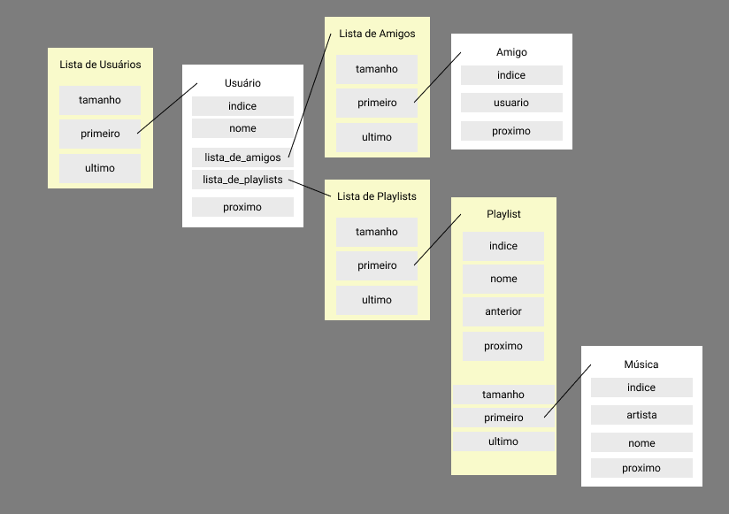

# PlayED

por _Álvaro Davi S. Alves_ - **2020101874**

Primeiro trabalho de ```Estrutura de Dados I```


#### Turma de Engenharia da Computação :computer:

### Universidade Federal do Espirito Santo ([UFES](https://ufes.br))


   

____


- [ ] Código criado com conteúdo visto em aula
    - [ ] Tipos Abstratos de Dados
    - [ ] Estruturas Opacas
    - [ ] Ponteiros para Void
    - [ ] Ponteiros para Funções
    - [ ] Listas Encadeadas
        - [ ] Simplesmente Ligadas
        - [ ] Cirulares
        - [ ] Duplamente Ligadas
        - [ ] Heterogêneas
    - [ ] Gerenciamento de Memória
    - [ ] Modularização
    - [ ] Leitura de Arquivos

- [ ] Documentar funções, estruturas, constantes e macros nos arquivos header em `include` (comentários multilinha)  
- [ ] Documentar trechos complicados do código nos arquivos source em `src` (comentários em uma linha)  
- [ ] Criar makefile para compilar os arquivos
- [ ] Criar arquivo PDF com documentação separada em:  
- **Introdução:**  
Criação de um programa para gerenciar músicas em playlists e relação de usuários no estilo rede social escrito na linguagem procedural estruturada C utilizando tipos abstratos de dados, modularização, leitura de arquivos, estruturas de dados e gerenciamento de memória.  
- **Implementação:**  
O programa é dividido nos arquivos {...} onde a implementação das funções e dos tipos abstratos se encontram em arquivos de extensão .c no diretório `src` e suas definições e protótipos se encontram em arquivos de extensão .h no diretório `include`. <br>
<br>
Abaixo, o diagrama representativo de cada tipo implementado:
<br>

<br>
<br>
A seguir, as principais funções existentes no programa representadas em diagrama:
<br>

<br>

* _Estruturas e TADs Implementados:_
 - **Lista de Usuários:** lista individualmente encadeada contendo Tamanho, Primeiro e Último Usuário
   * _Usuário:_ TAD contendo Índice, Nome, Lista de Amigos, Lista de Playlists e Próximo Usuário
 - **Lista de Amigos:** lista individualmente encadeada contendo Tamanho, Primeiro e Último Amigo
   * _Amigo:_ TAD contendo Índice, Usuário e Próximo Amigo
 - **Lista de Playlists:** lista duplamente encadeada contendo Tamanho, Primeira e Última Playlist
   * _Playlist:_ TAD contendo Índice, Nome, Anterior e Próxima Playlist e lista individualmente encadeada contendo Tamanho, Primeira e Última Música
     > _Música:_ TAD contendo Índice, Nome, Artista e Próxima Música

- **Conclusão:**  
O trabalho abordou de forma clara e eficiente o uso de estruturas de dados para os mais diversos fins, explicitando a aplicação de tais estruturas desde os mais simples programas aos mais complexos sistemas.  
As maiores dificuldades encontradas foram no uso de _void pointers_ e _heteroegeneous linked-lists_.  

- **Bibliografia:**  
[listas encadeadas - IME-USP](https://www.ime.usp.br/~pf/algoritmos/aulas/lista.html)  
[singly-linked list - TutorialsPoint](https://www.tutorialspoint.com/data_structures_algorithms/linked_list_program_in_c.htm)  
[dooubly-linked list - GeeksforGeeks](https://www.geeksforgeeks.org/doubly-linked-list/)  

